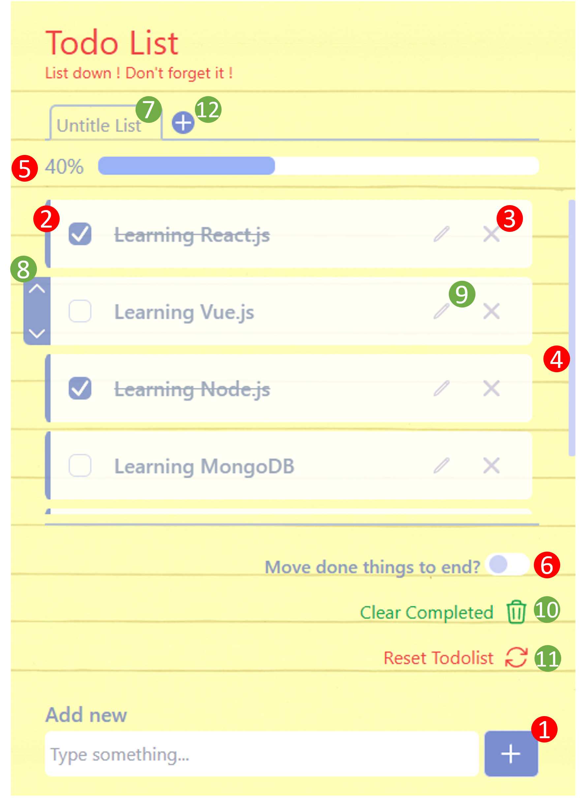
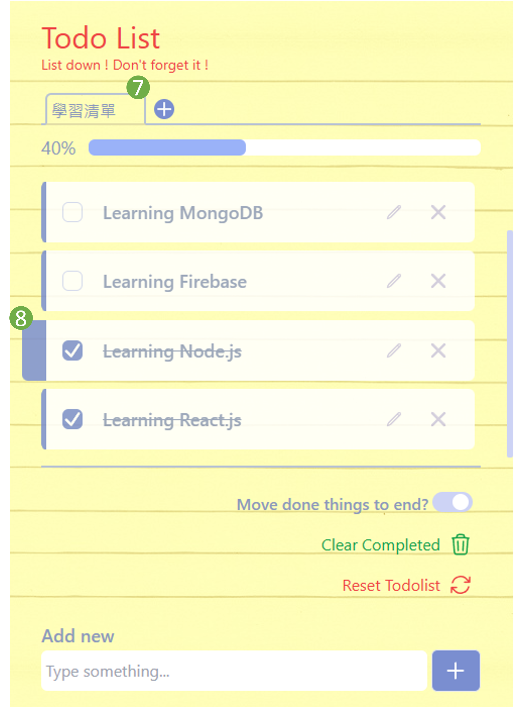
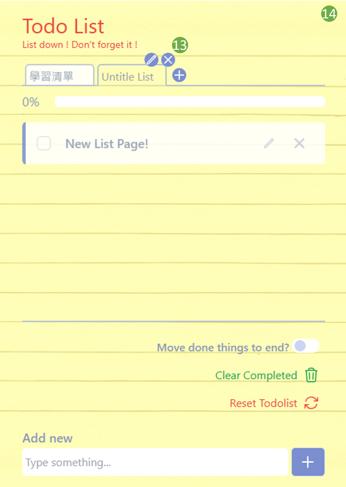

### demo: https://meteoroidalbert.github.io/Todolist_App_new/
### Todo List 功能說明

|  |  |
|:-------------------------------:|:-------------------------------:|
| **(圖一)**                     | **(圖二)**                     |

1\. 輸入鈕：於輸入框寫入事項後按下，可將事項加入待辦清單，新加入事項恆排在最下方，加入後滾動軸將自動滾到該新增事項處。 

2\. 勾選框：勾選列表內的事項，則該事項會被畫上刪除線，成為完成事項。 

3\. 刪除鈕：點擊任意事項的刪除鈕後，該事項將從整個事項清單中刪除。 

4\. 滾動軸：用於滾動閱覽事項清單。 

5\. 進度條：基於完成事項與待辦事項計算完成進度。 

6\. 切換鈕：開啟時，完成事項將被排到事項清單內最下方，待辦事項則皆在完成事項之上；再次點即可關閉，事項清單排序將回復原狀，以事項加入的時間進行排序。

(按鈕打開下，完成事項除了會排列到列表最下方，排列的順序將是依照被勾選完成的順序進行排列)

7\. 清單標題編輯鈕：游標移動到清單標題上會出現編輯按鈕，點選後可以編輯標題，標題編輯完成後，再按一次新出現的完成編輯按鈕或者Enter按鍵能夠保存編輯後標題，如(圖二)。

8\. 排序調整鈕：切換鈕(6)關閉時，游標移動到清單中任一事項上，該事項左側會出現排序調整按鈕，可以調整該待辦/完成事項的排序，如(圖一)。切換鈕開啟時，僅可進行待辦事項的排序調整，如(圖二)。

9\. 事項編輯鈕：刪除鈕(3)左側為編輯事項內容按鈕，點擊可以更改該待辦/完成事項內容，但不影響排序。再次點擊該按鈕或者Enter按鍵可以結束並保存編輯內容。

10\. 清除完成事項鈕：可以清除所有完成事項(注意：進度條會因為完成事項減少而變化)。

11\. 重置清單鈕：將該頁事項清單重置，刪除所有待辦/完成事項、清單標題。

12\. 新增事項清單鈕：點擊後，新增一頁事項清單，最多支持三頁。點擊新標題頁籤將可切換到新清單頁面，清單之間內容相互獨立存在，如(圖三)。

    <figure style="display: inline-block; text-align: center; margin: 1px;">
        
        <figcaption>(圖三)</figcaption>
    </figure>

13\. 關閉清單鈕：位於清單邊擊鈕(7)右側，點擊後，可將該頁清單關閉。(注意：會清除清單內待辦/完成事項、標題)

14\. 持久化儲存：使用Session Storeage持久化儲存所有清單內容。(在不關閉該瀏覽器分頁為前提下)
